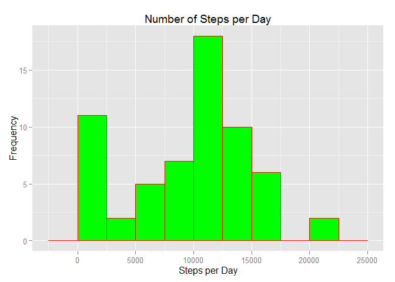
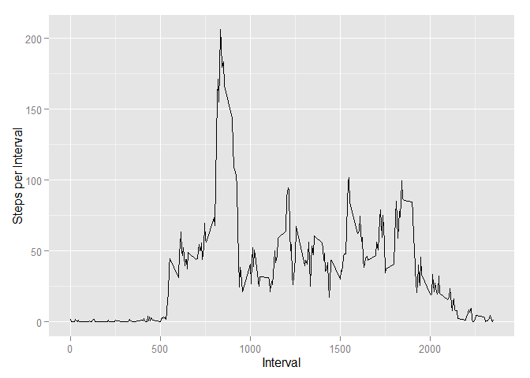
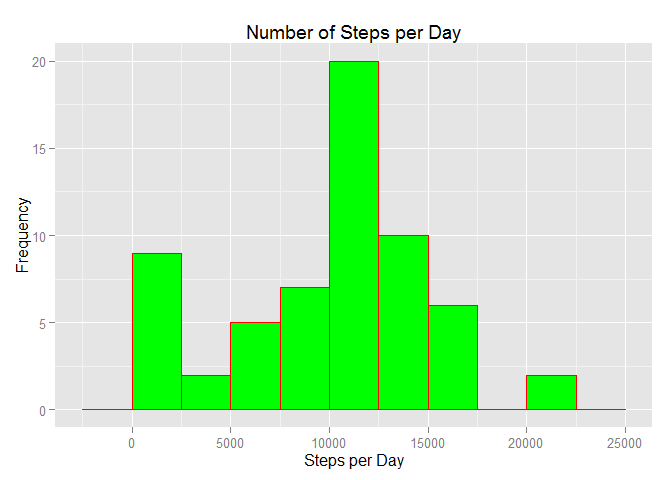
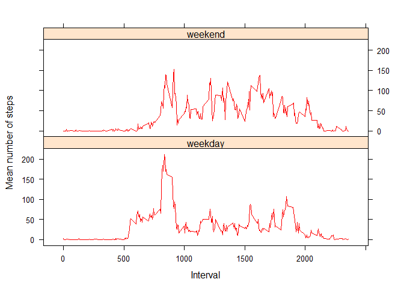

# Reproducible Research: Peer Assessment 1


## Loading and preprocessing the data

This downloads the data, unzips it, and loads it into working directory as variable "data."

```r
#Reproducible Research, Project 1
#Download Data
library(downloader)
```

```
## Warning: package 'downloader' was built under R version 3.1.3
```

```r
url <- "https://d396qusza40orc.cloudfront.net/repdata%2Fdata%2Factivity.zip"
download(url, dest="activity dataset.zip", mode="wb")
unzip("activity dataset.zip")
data <- read.csv("activity.csv")
print("Sweet, the data is downloaded, unzipped, and is in your working directory.")
```

```
## [1] "Sweet, the data is downloaded, unzipped, and is in your working directory."
```

Preprocess the data by creating three new dataframes.  One will be for steps per day, one for total steps per interval, and one for mean steps per interval.


```r
#change date column from factor to date format
data$date <- as.Date(data$date)

#create a dataframe for steps for day
stepsperday <- aggregate(data$steps, by=list(data$date),sum,na.rm=T)
names(stepsperday)[1] <- "Day"
names(stepsperday)[2] <- "Steps"

#create a dataframe for total steps per interval
total_steps_per_interval <- aggregate(data$steps, by=list(data$interval),sum,na.rm=T)
names(total_steps_per_interval)[1] <- "Interval"
names(total_steps_per_interval)[2] <- "Total_Steps"

#create a dataframe for average steps per interval
avg_steps_per_interval <- aggregate(data$steps, by=list(data$interval),mean,na.rm=T)
names(avg_steps_per_interval)[1] <- "Interval"
names(avg_steps_per_interval)[2] <- "Average_Steps"
```

## What is mean total number of steps taken per day?
Creates a histogram of stpes per day:

```r
library(ggplot2)
```

```
## Warning: package 'ggplot2' was built under R version 3.1.3
```

```r
ggplot(data=stepsperday, aes(stepsperday$Steps)) + geom_histogram(col="red", fill= "green", binwidth = 2500) + labs(title="Number of Steps per Day") + labs(x="Steps per Day", y="Frequency")
```

 
Calculates the mean and median steps taken perday.

```r
stepmean <- mean(stepsperday$Steps)
stepmedian <- median(stepsperday$Steps)
```
The mean steps per day is 9354.2295082.

The median steps per day is 10395.


## What is the average daily activity pattern?

Makes a time series plot (i.e. type = "l") of the 5-minute interval (x-axis) and the average number of steps taken, averaged across all days (y-axis):

```r
ggplot(avg_steps_per_interval, aes(Interval,Average_Steps)) + geom_line() + xlab("Interval") + ylab("Steps per Interval")
```

 
Finds the interval with the max number of average steps:

```r
max_interval <- avg_steps_per_interval[which.max(avg_steps_per_interval$Average_Steps), ]
```
The interval with the highest average steps is 835 with an average number of steps of 206.1698113.


## Imputing missing values

Calculates the number and percentage of missing values:

```r
library(scales)
```

```
## Warning: package 'scales' was built under R version 3.1.3
```

```r
complete <- nrow(data[complete.cases(data),])
incomplete <- nrow(data[!complete.cases(data),])
percentage <- percent(complete/nrow(data))
```
There are 2304 rows with missing values and 15264 complete rows.  86.9% rows have complete values.

Fill in missing data by using the average of previous and next observation

```r
step_interpolation <- function(rownumber){
  prevrow=rownumber;
  nextrow=rownumber;
  while(is.na(data$steps[prevrow])){
    prevrow=prevrow-1
    if(prevrow<1)return(mean(data[data$interval==data$interval[rownumber],"steps"],na.rm=TRUE))
  }
  while(is.na(data$steps[nextrow])){
    nextrow=nextrow+1
    if(nextrow>nrow(data))return(mean(data[data$interval==data$interval[rownumber],"steps"],na.rm=TRUE))
  }
  return(
    (data$steps[prevrow]+data$steps[nextrow])/2
  )
}

data2 <-data
for(n in 1:nrow(data2)){
  if(is.na(data2$steps[n])){
    data2$steps[n]=step_interpolation(n);
  }
}
```
Make a new histogram showing the imputed data:


```r
stepsperday2 <- stepsperday
stepsperday2 <- aggregate(data2$steps, by=list(data2$date),sum,na.rm=T)
names(stepsperday2)[1] <- "Day"
names(stepsperday2)[2] <- "Steps"
library(ggplot2)
ggplot(data=stepsperday2, aes(stepsperday2$Steps)) + geom_histogram(col="red", fill= "green", binwidth = 2500) + labs(title="Number of Steps per Day") + labs(x="Steps per Day", y="Frequency")
```

 
Recalculates the mean and median steps taken perday.

```r
##original mean and median
stepmean <- mean(stepsperday$Steps)
stepmedian <- median(stepsperday$Steps)
##imputed mean and median
stepmean2<- mean(stepsperday2$Steps)
stepmedian2<- median(stepsperday2$Steps)
```
The mean steps per day with NAs is 9354.2295082.
The mean steps per day without NAs is 9707.219301.

The median steps per day with NAs is 10395.
The median steps per day without NAs is 1.0571\times 10^{4}.

As one can see, the median did change slightly when the NAs were imputed.

## Are there differences in activity patterns between weekdays and weekends?

Create a column with two factors: weekday and weekend:

```r
weekday     <- weekdays(data2$date)
dayofweek   <- cbind(data2, weekday)
weekend   <- ifelse(dayofweek$weekday %in% c("Monday","Tuesday","Wednesday","Thursday","Friday"), "weekday", "weekend")
weekday   <- cbind(dayofweek, weekend)
```
2. Make a panel plot containing a time series plot (i.e. type = "l") of the 5-minute interval (x-axis) and the average number of steps taken, averaged across all weekday days or weekend days (y-axis).


```r
# load the lattice package
library(lattice)
```

```
## Warning: package 'lattice' was built under R version 3.1.3
```

```r
#summarize the number of steps by interval by weekend and weekday
colnames(weekday)[5] <- "day"
daytypesteps <- aggregate(steps ~ interval + day, data = weekday, mean)

#create a xyplot
xyplot(steps ~ interval | day, daytypesteps, type = "l", layout = c(1, 2), 
    xlab = "Interval", ylab = "Mean number of steps", col = "red")
```

 
